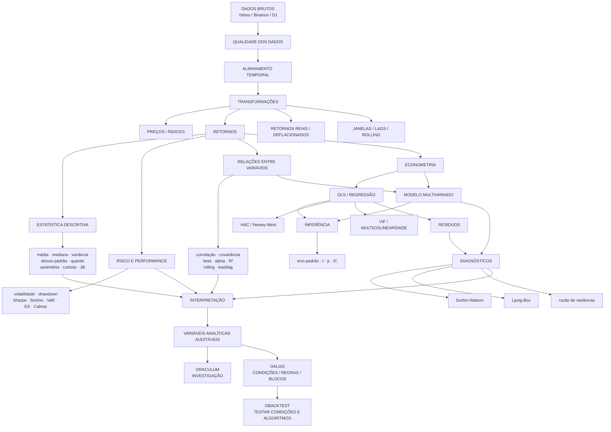

# Oraculum — Mapa da camada de análises

A camada de análises é uma linha de produção investigativa. O resultado final não é apenas um indicador: é uma variável analítica auditável que pode alimentar o OAlgo.

## Camadas

1. Dados — origem, timestamp, frequência, qualidade e cobertura.
2. Transformações — preço, retorno simples/log, deflação, janelas e defasagens.
3. Estatística — descrição da distribuição e comportamento.
4. Risco — retorno, volatilidade, drawdown e cauda.
5. Relações — associação entre ativos e variáveis.
6. Econometria — regressões, inferência, HAC e modelos multivariados.
7. Diagnóstico — verificar se o modelo deixou padrões sistemáticos nos resíduos.
8. Interpretação — explicar o resultado sem confundir associação com causalidade.
9. Condições analíticas — transformar resultados em objetos reutilizáveis pelo OAlgo.

## Princípio central

Oraculum descobre e mede. OAlgo combina condições. OBacktest testa se essas condições funcionam em diferentes contextos.

Isso mantém a matemática e a investigação no Oraculum, o desenho visual/algorítmico no OAlgo e a avaliação histórica no OBacktest.

## Evolução planejada

- correlação → correlação móvel → lead/lag;
- OLS → HAC → diagnósticos;
- regressão multivariada → modelos dinâmicos;
- séries reais → comparação nominal/real;
- associação → testes de causalidade;
- modelo histórico → walk-forward/out-of-sample;
- condições simples → combinações complexas no OAlgo.

Cada expansão deve manter o mesmo contrato de auditabilidade.